# PRD — LetCode App

**Product Requirements Document**

Platform latihan coding bergaya LeetCode untuk **persiapan interview kerja**, dengan
soal bertingkat (easy → expert), jalur belajar step by step, dan **live coding langsung
di browser**.

Dokumen ini adalah konsolidasi teknis dari `note.md` (konsep) dan `blueprint.md` (logika),
ditambah sequence diagram untuk setiap alur.

> **Aturan wajib sebelum mulai kerja di proyek ini**
> 1. Baca `note.md`, `blueprint.md`, dan `PRD.md` terlebih dahulu. Bila ada konflik antar dokumen, urutan prioritas: **PRD > blueprint > note**.
> 2. Bila prompt ambigu atau punya lebih dari satu tafsir yang masuk akal → **tanya dulu**, jangan langsung eksekusi.
>
> Detail lengkap: bagian **22. Aturan Kerja & Protokol Eksekusi**.

| Meta | Nilai |
| --- | --- |
| Status | Draft — menunggu implementasi |
| Versi | 1.0 |
| Prinsip UI | **Clean & minimalis** (bagian 15.1) |
| Bahasa produk | Indonesia |
| Target rilis pertama | Fase 0 |

---

## 1. Ringkasan Produk

### 1.1 Masalah
Latihan interview butuh tiga hal sekaligus: **kurikulum yang terurut**, **tempat menulis
kode**, dan **penilaian yang objektif**. LeetCode kuat tapi berbahasa Inggris dan
kurikulumnya tidak selalu selaras untuk pemula. Tutorial lokal biasanya hanya teori
tanpa penilaian otomatis.

### 1.2 Solusi
Satu situs statis yang menggabungkan:
1. **Kurikulum** roadmap DSA yang terurut.
2. **Editor + runner** di browser, tanpa server.
3. **Judge** berbasis test case dengan verdict objektif.

### 1.3 Value Proposition
- Nol biaya operasional: tanpa backend, tanpa database, tanpa server eksekusi.
- Jalur belajar jelas: tiap topik punya materi singkat → contoh berguided → latihan.
- Objektif: jawaban dinilai test case, bukan sekadar "benar/salah" manual.

---

## 2. Goals & Non-Goals

### 2.1 Goals
| # | Goal | Ukuran keberhasilan |
| --- | --- | --- |
| G1 | Pengguna bisa mengerjakan soal end-to-end di browser | Run + Submit memberi verdict tanpa server |
| G2 | Kurikulum terurut dan bisa diikuti | 1 track lengkap 20–30 soal berkualitas |
| G3 | Biaya operasional nol | Semua infrastruktur di free tier |
| G4 | Konten selalu valid | Pipeline validasi memblokir build jika ada soal cacat |
| G5 | Progress tersimpan | Progres bertahan setelah refresh/tutup browser |

### 2.2 Non-Goals (untuk saat ini)
- Penilaian kelas/ujian yang bisa dipercaya (hidden test di browser tidak bisa disembunyikan).
- Bahasa selain Python dan JavaScript.
- Fitur sosial (diskusi, leaderboard, follow).
- Multi-user, auth, sinkronisasi lintas perangkat.
- Soal tipe stdin/stdout ala Codeforces.

### 2.3 Keputusan yang Sudah Dikunci

| Topik | Keputusan |
| --- | --- |
| Target pengguna | Persiapan / latihan interview kerja |
| Biaya | Nol — tidak keluar biaya sepeser pun |
| Bahasa soal | Python + JavaScript |
| Sifat situs | Personal / portofolio dulu, publik menyusul |
| Strategi eksekusi | Browser-first (tanpa server) |
| Gaya soal | Function signature ala LeetCode |
| Toolchain | Nuxt 4 (Vue 3) + TypeScript |
| Styling | UnoCSS + `@vinicunca/unocss-preset` |
| Editor | Monaco |
| Ikon | Lucide lewat UnoCSS preset-icons (tanpa file SVG) |
| Tipografi | System font stack (tanpa aset font) |
| Tema | Light + dark; default ikut sistem, pilihan pengguna disimpan |
| Animasi tema | Transisi warna halus, maksimal 200 ms |
| Bahasa antarmuka | Indonesia (id) + Inggris (en); default ikut bahasa browser, fallback `id` |
| Prinsip UI | Clean & minimalis (bagian 15.1) |

Keputusan di tabel ini hanya berubah bila diminta secara eksplisit (lihat bagian 22.3).

---

## 3. Pengguna & User Journey

### 3.1 Persona
**Pengguna tunggal, personal.** Sedang menyiapkan interview teknis, nyaman dasar
JavaScript atau Python, ingin latihan terstruktur tanpa biaya.

### 3.2 Journey Utama
1. Buka situs → lihat roadmap track → pilih track pertama.
2. Baca materi singkat → kerjakan soal pertama.
3. Tulis solusi di editor → klik **Run** untuk cek contoh.
4. Klik **Submit** → verdict.
5. Jika Accepted → baca pembahasan → lanjut soal berikutnya.
6. Jika gagal → baca test case yang gagal → perbaiki → Submit lagi.
7. Progress otomatis tersimpan; kembali kapan saja tanpa kehilangan kode.

---

## 4. Scope & Fase

| Fase | Isi | Definisi selesai |
| --- | --- | --- |
| **0** | 1 track, JavaScript saja, Monaco, Run sample, Submit, progress lokal | Bisa menyelesaikan 1 track penuh di browser |
| **1** | Python via Pyodide, konsol log, pembahasan solusi, hint | Dua bahasa berjalan, pembahasan terbuka setelah Accepted |
| **2** | Deploy statis, tambah track, filter/pencarian, riwayat submission | Situs publik dengan >1 track |
| **3** | Auth, leaderboard, diskusi, judge self-host | Penilaian yang bisa dipercaya |

**Fase 0 adalah fokus PRD ini.** Fase lain hanya batas ekspansi.

---

## 5. Fitur & Acceptance Criteria

### F0-1 Katalog Track
Daftar track roadmap DSA terurut, dengan progres tiap track.
**AC:** menampilkan judul, ringkasan, `solved/total`, dan persentase dari `localStorage`.

### F0-2 Daftar Soal per Track
**AC:** menampilkan soal terurut, difficulty, dan status (unsolved/attempted/solved).

### F0-3 Workspace Soal
Halaman split: deskripsi (kiri) dan editor + panel hasil (kanan).
**AC:** menampilkan pernyataan, contoh, editor berisi template, tombol Reset/Run/Submit.

### F0-4 Run (Sample Test)
Menjalankan kode terhadap test case yang terlihat.
**AC:** menampilkan status tiap case; **tidak** mengubah progress.

### F0-5 Submit (Semua Test)
Menjalankan kode terhadap seluruh test case, menghasilkan verdict.
**AC:** Accepted → soal ditandai solved; gagal → ditandai attempted.

### F0-6 Editor Monaco
**AC:** syntax highlight untuk JS, template awal per soal, tombol Reset ke template.

### F0-7 Draft Otomatis
**AC:** kode tersimpan per `slug` + `language`; saat kembali, draft dipulihkan.

### F0-8 Progress Lokal
**AC:** status soal dan progres track bertahan setelah refresh.

### F0-9 Tema Light & Dark
**AC:** tema default mengikuti setelan sistem; toggle mengganti tema dengan transisi
halus; pilihan tersimpan dan bertahan setelah refresh; tidak ada kedipan tema saat muat.

### F1-1 Python via Pyodide
**AC:** memilih Python memuat Pyodide on-demand; Run/Submit bekerja sama seperti JS.

### F1-2 Panel Konsol
**AC:** `console.log`/`print` dari kode user tampil di panel, dipisah dari hasil test.

### F1-3 Pembahasan Solusi
**AC:** hanya tampil setelah soal berstatus solved.

### F2-1 Deploy Statis
**AC:** `nuxt generate` menghasilkan aset statis yang bisa dilayani hosting gratis.

---

## 6. Information Architecture

### 6.1 Route
| Route | File | Isi |
| --- | --- | --- |
| `/` | `app/pages/index.vue` | Dashboard: progres keseluruhan + kartu track |
| `/tracks` | `app/pages/tracks/index.vue` | Semua track sebagai roadmap |
| `/tracks/[trackId]` | `app/pages/tracks/[trackId].vue` | Materi + daftar soal + progres |
| `/problems` | `app/pages/problems/index.vue` | Semua soal + filter |
| `/problems/[slug]` | `app/pages/problems/[slug].vue` | Workspace |
| `/about` | `app/pages/about.vue` | Opsional |
| — | `app/error.vue` | 404 |

### 6.2 Layout Workspace
```
┌───────────────┬──────────────────────────────┐
│ Deskripsi     │ Toolbar: [bahasa] [Reset]     │
│ - pernyataan  │ ┌──────────────────────────┐ │
│ - contoh      │ │ Monaco Editor            │ │
│ - hint        │ └──────────────────────────┘ │
│ - solusi      │ [Run sample] [Submit]         │
│   (unlocked)  │ ┌──────────────────────────┐ │
│               │ │ Panel hasil + konsol      │ │
│               │ └──────────────────────────┘ │
└───────────────┴──────────────────────────────┘
```

---

## 7. Arsitektur Teknis

### 7.1 Empat Lapis
| Lapis | Isi | Tahu tentang | Tidak tahu tentang |
| --- | --- | --- | --- |
| **1. Content** | Data track/soal/test case + loader | `Track`, `Problem` | UI, runner |
| **2. Runner** | Eksekusi, komparator, verdict | `RunRequest`, `RunResult` | UI, localStorage |
| **3. State** | Progress, draft, submission | `localStorage` | UI |
| **4. UI** | Halaman + komponen | lapis 1–3 | detail Worker |

**Aturan ketergantungan (wajib):**
- UI **tidak pernah** memanggil Worker langsung — selalu lewat State → Runner.
- Runner **tidak pernah** menyentuh `localStorage` — murni fungsi.
- Content **tidak pernah** memanggil Runner.

### 7.2 Diagram Arsitektur
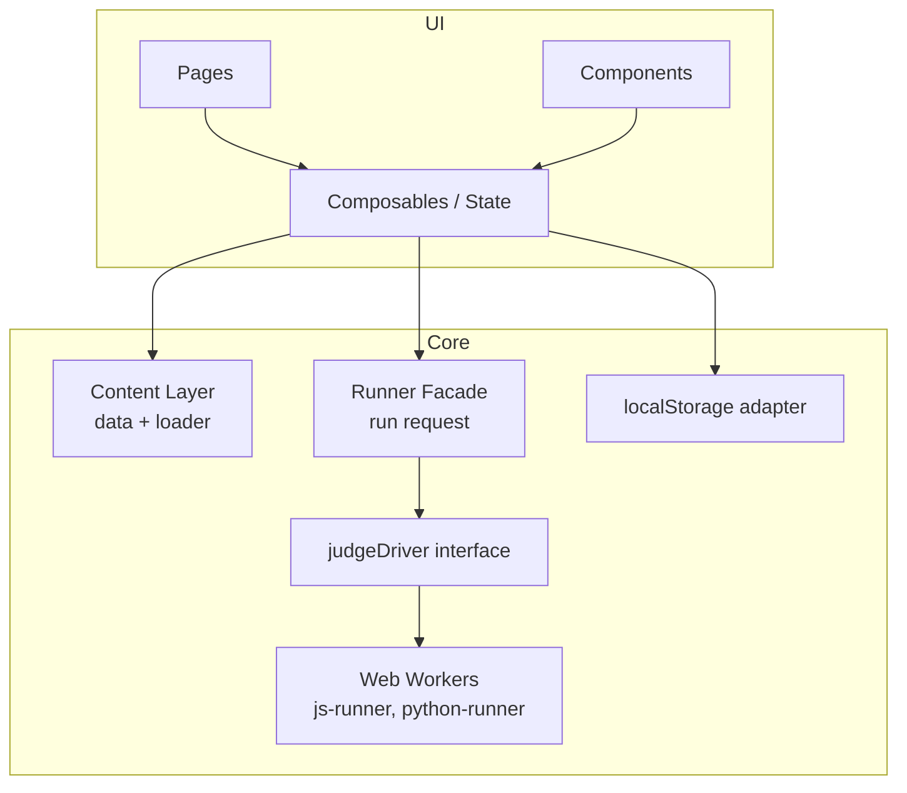
```mermaid
graph TD
  subgraph UI
    Pages[Pages]
    Components[Components]
    Composables[Composables / State]
  end
  subgraph Core
    Content[Content Layer<br/>data + loader]
    Judge[Runner Facade<br/>run request]
    Driver[judgeDriver interface]
    Workers[Web Workers<br/>js-runner, python-runner]
    Storage[localStorage adapter]
  end
  Pages --> Composables
  Components --> Composables
  Composables --> Content
  Composables --> Judge
  Composables --> Storage
  Judge --> Driver
  Driver --> Workers
```

### 7.3 Mode Rendering
**SPA (`ssr: false`) + `nuxt generate`.**
Alasan: Monaco, Pyodide, dan `localStorage` semuanya client-only. SSR tidak memberi nilai
dan hanya menambah masalah hidrasi.

---

## 8. Tech Stack Terpasang

| Paket | Versi | Peran |
| --- | --- | --- |
| `nuxt` | 4.5.2 | Framework, SPA + static generate |
| `vue` | 3.5.43 | UI runtime |
| `vue-router` | 5.3.1 | Routing (dipakai Nuxt) |
| `@unocss/nuxt` | 66.10.5 | Integrasi UnoCSS |
| `unocss` | 66.10.5 | Engine CSS |
| `@vinicunca/unocss-preset` | 2.4.0 | Preset theme, fluid, animasi |
| `unocss-variants` | 1.5.0 | API varian komponen (`uv`) |
| `@vinicunca/perkakas` | 1.17.1 | Utilitas fungsional; `isDeepEqual` untuk komparator |
| `eslint` | 10.12.0 | Linter |
| `@vinicunca/eslint-config` | 5.7.1 | Flat config opinionated |
| `@unocss/eslint-plugin` | 66.10.5 | Lint class UnoCSS |
| `eslint-plugin-sonarjs` | 4.2.2 | Peer wajib config eslint |
| `@iconify-json/lucide` | — | Koleksi ikon Lucide untuk UnoCSS preset-icons (belum dipasang) |
| Monaco (`monaco-editor`) | — | Editor (belum dipasang, Fase 0 langkah 5) |
| Pyodide | — | Python WASM (belum dipasang, Fase 1) |

**Catatan build:** pnpm 10 memblokir build script; `esbuild` diizinkan lewat
`pnpm.onlyBuiltDependencies` di `package.json`.

---

## 9. Desain Data

### 9.1 Types — Content
```ts
type LanguageId = 'javascript' | 'python';
type Difficulty = 'easy' | 'medium' | 'hard' | 'expert';
type ComparatorId = 'deepEqual' | 'unorderedDeepEqual' | 'unorderedAllLevels' | 'floatApprox';

// Bahasa antarmuka & konten (bagian 24)
type Locale = 'id' | 'en';
type Localized<T> = Record<Locale, T>;

/** Satu sub-bab materi. `id` dipakai sebagai anchor daftar isi. */
interface MaterialSection {
  id: string;
  title: Localized<string>;
  body: Localized<string>; // markdown
}

interface Track {
  id: string; // 'arrays-hashing'
  title: Localized<string>;
  order: number;
  summary: Localized<string>;
  sections: Array<MaterialSection>; // 4–5 sub-bab
  problemSlugs: Array<string>; // urutan belajar
}

interface TestCase {
  id: string;
  input: Array<unknown>; // array argumen fungsi
  expected: unknown;
  hidden?: boolean;
  comparator?: ComparatorId;
  tolerance?: number;
}

interface Example {
  input: string; // tampilan manusia, tidak diterjemahkan
  output: string; // tidak diterjemahkan
  explanation?: Localized<string>;
}

interface CodeTemplate {
  language: LanguageId;
  template: string; // starter berisi function signature
  solution: string; // reference solution, untuk validasi konten
}

interface Problem {
  slug: string;
  title: Localized<string>;
  difficulty: Difficulty;
  trackId: string;
  order: number;
  statement: Localized<string>; // markdown
  examples: Array<Example>;
  functionName: string;
  parameters: Array<{ name: string; type: string }>;
  returnType: string;
  timeLimitMs: number;
  hints: Localized<Array<string>>;
  explanation?: Localized<string>; // markdown, setelah Accepted
  templates: Array<CodeTemplate>;
  testCases: Array<TestCase>;
}
```

### 9.2 Types — Runner
```ts
interface RunRequest {
  language: LanguageId;
  code: string;
  functionName: string;
  testCases: Array<TestCase>;
  timeLimitMs: number;
}

type CaseStatus = 'passed' | 'failed' | 'error' | 'timeout';

interface CaseResult {
  testCaseId: string;
  hidden: boolean;
  status: CaseStatus;
  input?: Array<unknown>; // undefined kalau hidden
  expected?: unknown;
  actual?: unknown;
  error?: string;
  durationMs: number;
}

type RunStatus
  = | 'accepted'
    | 'wrong-answer'
    | 'runtime-error'
    | 'time-limit-exceeded'
    | 'compile-error'
    | 'internal-error';

interface RunResult {
  status: RunStatus;
  cases: Array<CaseResult>;
  logs: Array<string>;
  durationMs: number;
}
```

### 9.3 Types — State
```ts
type ProblemStatus = 'unsolved' | 'attempted' | 'solved';

interface ProblemRecord {
  slug: string;
  status: ProblemStatus;
  attempts: number;
  solvedAt?: number;
  lastLanguage?: LanguageId;
}

interface ProgressStore {
  version: 1;
  problems: Record<string, ProblemRecord>;
}

interface SettingsStore {
  version: 1;
  preferredLanguage: LanguageId;
}
```

### 9.4 Kunci `localStorage`
| Kunci | Isi | Format |
| --- | --- | --- |
| `letcode:progress:v1` | `ProgressStore` | JSON |
| `letcode:settings:v1` | `SettingsStore` | JSON |
| `letcode:theme:v1` | `'light'` atau `'dark'`; tidak ada berarti ikut sistem | string |
| `letcode:draft:{slug}:{language}` | kode user | string mentah |

Semua store punya field `version` untuk migrasi.

---

## 10. Kontrak Soal

Soal memakai **function-signature style** (bukan stdin/stdout).

**Aturan kontrak:**
1. Nama fungsi unik per soal dan sama di semua bahasa.
2. Parameter dan return harus **JSON-serializable**.
3. Satu test case = satu array argumen + satu nilai `expected`.
4. Template starter **wajib** memuat deklarasi fungsi dengan nama yang sama.
5. Reference solution **wajib** ada untuk setiap bahasa yang didukung.
6. Soal tanpa reference solution = tidak boleh tayang.

**Contoh kontrak:**
```
functionName: twoSum
parameters: [ { name: 'nums', type: 'number[]' }, { name: 'target', type: 'number' } ]
returnType: 'number[]'
timeLimitMs: 2000
testCases:
  - { id: 'c1', input: [[2,7,11,15], 9], expected: [0,1], comparator: 'deepEqual' }
  - { id: 'c2', input: [[3,2,4], 6],   expected: [1,2], hidden: true }
```

---

## 11. Mesin Eksekusi

### 11.1 Prinsip
Satu antarmuka yang bisa ditukar:
```ts
interface JudgeDriver {
  id: 'browser-js' | 'browser-pyodide' | 'remote';
  supports: (language: LanguageId) => boolean;
  run: (request: RunRequest) => Promise<RunResult>;
  warmup?: () => Promise<void>;
}
```
Fase 0–2 memakai driver browser. Fase 3 menambah `remote` tanpa mengubah UI.

### 11.2 Worker
| Worker | Bahasa | Strategi |
| --- | --- | --- |
| `app/workers/js-runner.ts` | JavaScript | Worker baru per eksekusi, `terminate()` setelah selesai |
| `app/workers/python-runner.ts` | Python (Pyodide) | Worker persisten; **jangan** di-terminate |

### 11.3 Protokol Pesan
**JS worker**
```
→ { type: 'run', code, functionName, testCases, timeLimitMs }
← { type: 'result', cases, logs }
← { type: 'error', kind: 'compile' | 'runtime', message }
```
**Python worker**
```
→ { type: 'load' }
← { type: 'ready' }
→ { type: 'run', code, functionName, testCases, timeLimitMs }
← { type: 'result', cases, logs }
```
Semua payload berupa objek JSON biasa (structured clone).

### 11.4 Strategi Harness
**JS:** sisipkan kode user lalu panggil namanya.
```
fn = new Function(`${code}; return ${functionName}`)()
```
**Python:** jalankan kode user, ambil callable dari globals.
```
pyodide.runPython(code)
fn = pyodide.globals.get(functionName)
```
Argumen dikonversi via `toPy` / `toJs`.

### 11.5 Batas Waktu
- Default `2000 ms`, bisa berbeda per soal (`Problem.timeLimitMs`).
- Ditangani **di luar** worker: timer di `runInWorker`, lalu `terminate()`.
- Di browser ini penanda kasar, **bukan** penilaian waktu yang presisi.

---

## 12. Komparator & Verdict

### 12.1 Komparator
| Id | Perilaku |
| --- | --- |
| `deepEqual` | `perkakas.isDeepEqual(actual, expected)` — paling ketat |
| `unorderedDeepEqual` | urutkan **koleksi terluar** saja, lalu `isDeepEqual` |
| `unorderedAllLevels` | urutkan **semua tingkat**, untuk hasil yang benar-benar himpunan |
| `floatApprox` | bandingkan per elemen dengan `\|a - b\| <= tolerance` |

Default: `deepEqual`. Komparator ditentukan per soal, dengan opsi override per test case.

**Kenapa dua varian unordered.** Membuat semua tingkat tidak terurut itu berbahaya: ia
akan menerima jawaban yang salah. Contoh nyata yang pernah lolos sebelum diperbaiki:

| Soal | Jawaban salah | Sebelum | Sesudah |
| --- | --- | --- | --- |
| `permutations` | enam kali `[1,2,3]` (bukan himpunan permutasi) | diterima | ditolak |
| `k-closest-points-to-origin` | koordinat dibalik `[2,1]` (titik berbeda) | diterima | ditolak |
| `subsets` | urutan dalam subset dibalik, padahal statement menjamin urutan asli | diterima | ditolak |

Aturan pemilihan:

1. Urutan koleksi tidak penting, **isi tiap elemen punya makna** → `unorderedDeepEqual`.
   Contoh: daftar titik (`[x, y]`), daftar permutasi (urutan dalam permutasi itu penting),
   daftar string.
2. Urutan koleksi tidak penting **dan** isi tiap elemen juga tidak penting (benar-benar
   himpunan) → `unorderedAllLevels`. Contoh: daftar triplet 3Sum, daftar grup anagram,
   daftar kombinasi.

Kalau ragu, pilih yang lebih ketat: menolak jawaban benar masih bisa diperbaiki dengan
menjelaskan representasi di statement; menerima jawaban salah merusak penilaian.

### 12.2 Aturan Verdict
```
1. ada case 'timeout'  → time-limit-exceeded
2. ada case 'error'    → runtime-error
3. ada case 'failed'   → wrong-answer
4. semua 'passed'      → accepted
5. cases kosong        → internal-error
```
Urutan prioritas disengaja: timeout/error lebih informatif daripada wrong answer.

---

## 13. Progress & Persistensi

- Seluruh `ProgressStore` disimpan sebagai satu JSON di `letcode:progress:v1`.
- Update memicu ref reaktif agar progres track langsung berubah di UI.
- Draft ditulis dengan **debounce 500 ms** supaya tidak menulis tiap ketikan.
- Tersedia `exportProgress()` / `importProgress(json)` untuk backup manual.

---

## 14. Validasi Konten (Build-time)

Script `scripts/validate-content.ts` dijalankan sebelum build:

1. `assertWellFormed(problem)` — cek field wajib, template cocok dengan `functionName`.
2. Untuk setiap template bahasa:
   - jalankan `solution` terhadap **semua** test case;
   - bandingkan dengan `expected` memakai komparator soal;
   - kumpulkan kegagalan.
3. Jika ada satu saja kegagalan → **exit 1**, build dibatalkan.

Ini satu-satunya pertahanan terhadap soal cacat.

---

## 15. Non-Functional Requirements

| Aspek | Target |
| --- | --- |
| Waktu muat awal | Cepat tanpa memuat Pyodide/Monaco blokir render |
| Pyodide | Dimuat **on-demand**, hanya saat Python dipilih |
| Browser | Chrome/Edge/Firefox/Safari versi modern (desktop prioritas) |
| Aksesibilitas | Navigasi keyboard, kontras cukup, label form |
| Privasi | Tidak ada data keluar perangkat; semua lokal |
| Offline | Tidak diwajibkan di Fase 0 |
| Tema | Tidak ada kedipan tema saat muat pertama |
| Biaya | Nol; seluruh infrastruktur di free tier |

### 15.1 Prinsip UI — Clean & Minimalis

**Prinsip**
1. **Satu layar, satu tujuan.** Halaman soal hanya punya dua tugas: membaca soal dan menulis kode. Tidak ada elemen yang tidak melayani keduanya.
2. **Hierarki lewat ruang, bukan garis.** Pisahkan elemen dengan jarak dan bobot huruf, bukan tumpukan border dan shadow.
3. **Warna hanya untuk makna.** Satu warna aksen untuk aksi utama; sisanya netral. Warna status hanya untuk Accepted / Wrong Answer / TLE / Error.
4. **Tipografi tenang.** Satu keluarga sans untuk UI, satu mono untuk kode. Sedikit tingkat ukuran, konsisten.
5. **Ruang putih cukup.** Lebih baik terasa lapang daripada padat.
6. **Gerakan minimal.** Transisi pendek hanya sebagai umpan balik; hormati `prefers-reduced-motion`.
7. **Tanpa dekorasi tanpa fungsi.** Tidak ada gradient ramai, ilustrasi besar, atau ikon yang tidak menyampaikan informasi.
8. **Kode adalah bintang di halaman soal.** Editor mendapat porsi ruang terbesar; chrome UI seminimal mungkin.

**Aturan konkret**
| Aspek | Aturan |
| --- | --- |
| Skala spasi | Kelipatan 4 (4 / 8 / 12 / 16 / 24 / 32) |
| Ukuran huruf | Maksimal 3 tingkat untuk UI, plus 1 mono untuk kode |
| Warna aksen | Maksimal 1 |
| Radius & shadow | Konsisten; maksimal 1 tingkat shadow |
| Animasi | Maksimal 200 ms, hanya untuk umpan balik |
| Keadaan kosong | Sederhana dan informatif, tanpa animasi panjang |

**Yang dihindari**
Gradient dekoratif, shadow berlapis, banyak warna aksen, ikon tanpa makna, animasi panjang,
dan layout padat tanpa jeda.

**Implementasi**
- Styling memakai UnoCSS dengan `@vinicunca/unocss-preset` (fluid typography, theme, animasi siap pakai).
- Varian komponen memakai `uv()` dari `unocss-variants` supaya konsisten dan tidak ada class berserakan.
- Ikon memakai Lucide lewat UnoCSS preset-icons sebagai class (`i-lucide-*`) — tidak ada file SVG.
- Tipografi memakai system font stack — tidak ada aset font dan tidak ada unduhan tambahan.
- Komponen yang sama wajib tampil dan berperilaku sama di semua halaman.

### 15.2 Tema — Light & Dark

**Perilaku**
- Tema diterapkan sebagai class `dark` pada elemen `<html>`.
- Saat pertama kali dibuka dan pengguna belum pernah memilih: **ikut sistem** (`prefers-color-scheme`).
- Setelah pengguna menekan toggle, pilihannya disimpan di `letcode:theme:v1` dan menimpa setelan sistem.
- Selama belum ada pilihan tersimpan, perubahan tema sistem operasi tetap diikuti.

**Animasi**
- Transisi warna halus, maksimal 200 ms, hanya untuk `background-color`, `color`, dan `border-color`.
- Transisi **tidak** dipasang permanen di semua elemen. Saat pergantian tema, class sementara `theme-transition` dipasang di `<html>` lalu dilepas setelah animasi selesai. Alasannya: transisi global yang permanen membuat hover dan interaksi lain terasa lambat.
- Hormati `prefers-reduced-motion`: bila aktif, transisi dimatikan.

**Mencegah kedipan tema saat muat**
- Script kecil dijalankan inline di `<head>` sebelum paint, untuk memasang class `dark` sesuai pilihan tersimpan atau setelan sistem.
- Tanpa ini, halaman tampil terang sesaat lalu berubah gelap.

**Detail teknis**
- `color-scheme: light | dark` diset pada `:root` dan `.dark`, supaya scrollbar dan kontrol bawaan browser ikut menyesuaikan.
- Editor Monaco ikut berganti tema (`vs` untuk light, `vs-dark` untuk dark) agar tidak ada kotak terang di tengah UI gelap.
- Ikon toggle memakai `i-lucide-sun` dan `i-lucide-moon`.
- Strategi dark UnoCSS wajib berbasis class, bukan media query. **Wajib diverifikasi saat implementasi**, karena default bawaan perlu dipastikan cocok dengan class `dark` di `<html>`.

---

## 16. Batasan & Trade-off yang Diterima

1. **Hidden test case tidak benar-benar tersembunyi.** Semua data dikirim ke browser.
   Cukup untuk latihan pribadi, **tidak** untuk penilaian yang dipercaya.
2. **Isolasi Worker bukan batas keamanan.** Web Worker hanya memberi batas waktu;
   kode user tetap berada di origin yang sama dan secara teknis bisa mengakses jaringan.
   Karena saat ini user menjalankan kode miliknya sendiri, risikonya rendah. Ini berubah
   jika nanti ada fitur menjalankan kode orang lain.
3. **TLE hanya penanda kasar**, bukan pengukuran presisi.
4. **Bahasa terbatas**: Python & JS. C++/Java tidak praktis di browser.
5. **Tanpa backend**: tidak ada sinkronisasi lintas perangkat maupun backup otomatis.

---

## 17. Sequence Diagram — Seluruh Alur

### S1. Cold Start Aplikasi
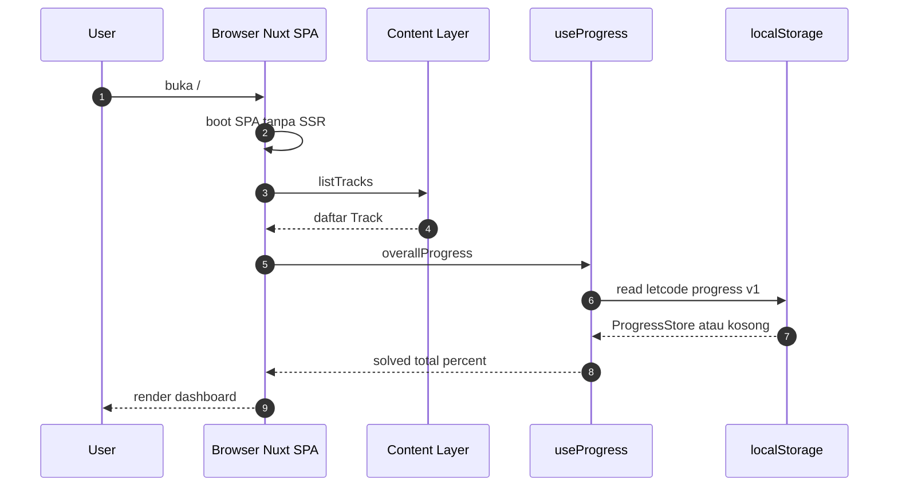
```mermaid
sequenceDiagram
  autonumber
  participant U as User
  participant B as Browser Nuxt SPA
  participant C as Content Layer
  participant P as useProgress
  participant LS as localStorage
  U->>B: buka /
  B->>B: boot SPA tanpa SSR
  B->>C: listTracks
  C-->>B: daftar Track
  B->>P: overallProgress
  P->>LS: read letcode progress v1
  LS-->>P: ProgressStore atau kosong
  P-->>B: solved total percent
  B-->>U: render dashboard
```

### S2. Jelajah Track ke Daftar Soal
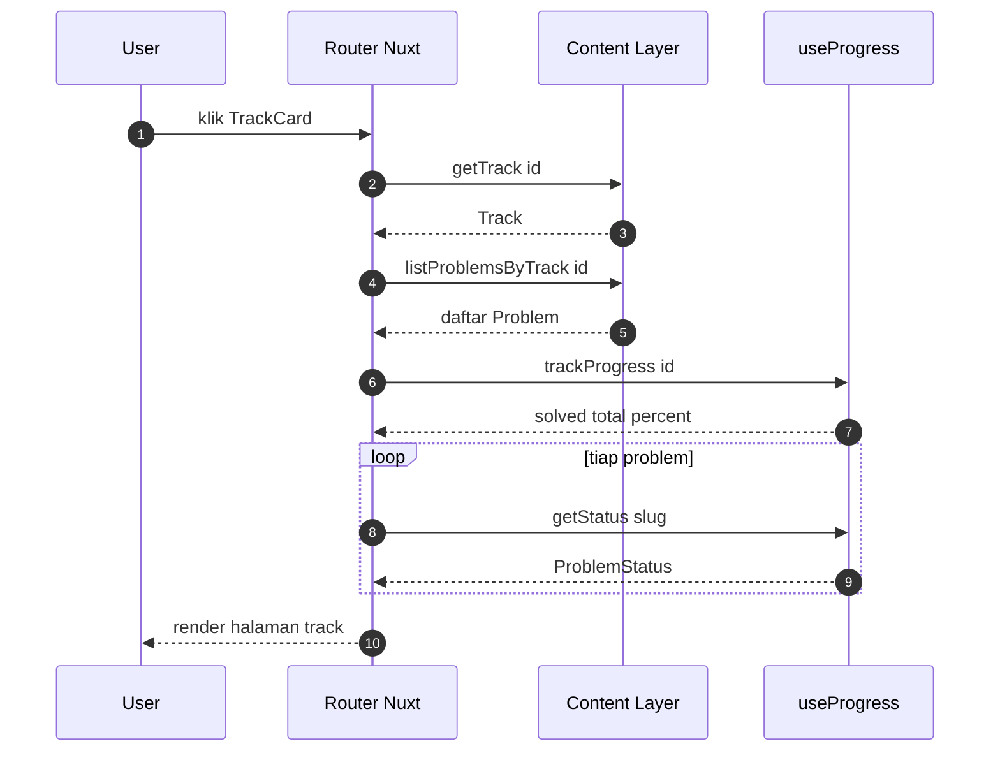
```mermaid
sequenceDiagram
  autonumber
  participant U as User
  participant R as Router Nuxt
  participant C as Content Layer
  participant P as useProgress
  U->>R: klik TrackCard
  R->>C: getTrack id
  C-->>R: Track
  R->>C: listProblemsByTrack id
  C-->>R: daftar Problem
  R->>P: trackProgress id
  P-->>R: solved total percent
  loop tiap problem
    R->>P: getStatus slug
    P-->>R: ProblemStatus
  end
  R-->>U: render halaman track
```

### S3. Inisialisasi Workspace Soal
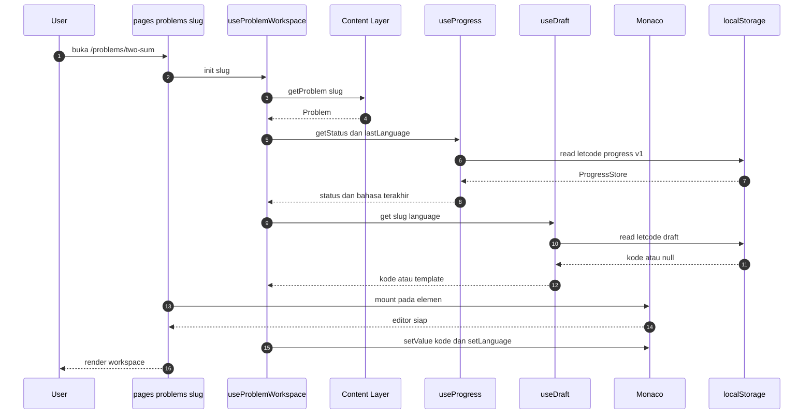
```mermaid
sequenceDiagram
  autonumber
  participant U as User
  participant PG as pages problems slug
  participant W as useProblemWorkspace
  participant C as Content Layer
  participant P as useProgress
  participant D as useDraft
  participant E as Monaco
  participant LS as localStorage
  U->>PG: buka /problems/two-sum
  PG->>W: init slug
  W->>C: getProblem slug
  C-->>W: Problem
  W->>P: getStatus dan lastLanguage
  P->>LS: read letcode progress v1
  LS-->>P: ProgressStore
  P-->>W: status dan bahasa terakhir
  W->>D: get slug language
  D->>LS: read letcode draft
  LS-->>D: kode atau null
  D-->>W: kode atau template
  PG->>E: mount pada elemen
  E-->>PG: editor siap
  W->>E: setValue kode dan setLanguage
  PG-->>U: render workspace
```

### S4. Ganti Bahasa
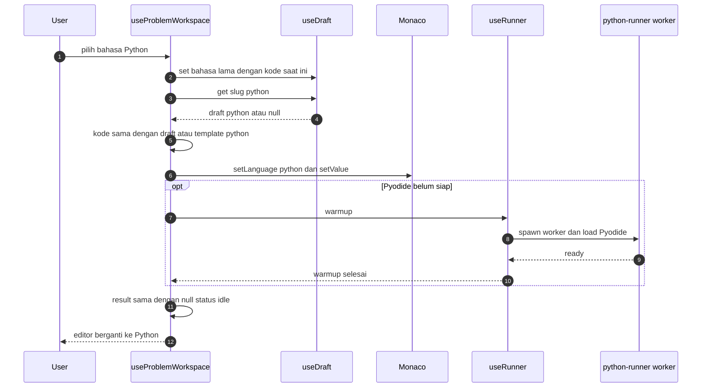
```mermaid
sequenceDiagram
  autonumber
  participant U as User
  participant W as useProblemWorkspace
  participant D as useDraft
  participant E as Monaco
  participant Rn as useRunner
  participant PW as python-runner worker
  U->>W: pilih bahasa Python
  W->>D: set bahasa lama dengan kode saat ini
  W->>D: get slug python
  D-->>W: draft python atau null
  W->>W: kode sama dengan draft atau template python
  W->>E: setLanguage python dan setValue
  opt Pyodide belum siap
    W->>Rn: warmup
    Rn->>PW: spawn worker dan load Pyodide
    PW-->>Rn: ready
    Rn-->>W: warmup selesai
  end
  W->>W: result sama dengan null status idle
  W-->>U: editor berganti ke Python
```

### S5. Autosave Draft
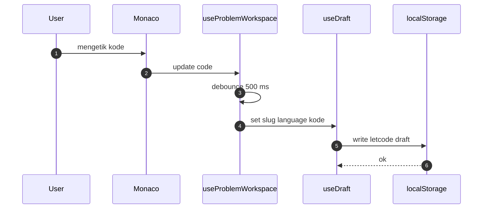
```mermaid
sequenceDiagram
  autonumber
  participant U as User
  participant E as Monaco
  participant W as useProblemWorkspace
  participant D as useDraft
  participant LS as localStorage
  U->>E: mengetik kode
  E->>W: update code
  W->>W: debounce 500 ms
  W->>D: set slug language kode
  D->>LS: write letcode draft
  LS-->>D: ok
```

### S6. Run Sample — JavaScript
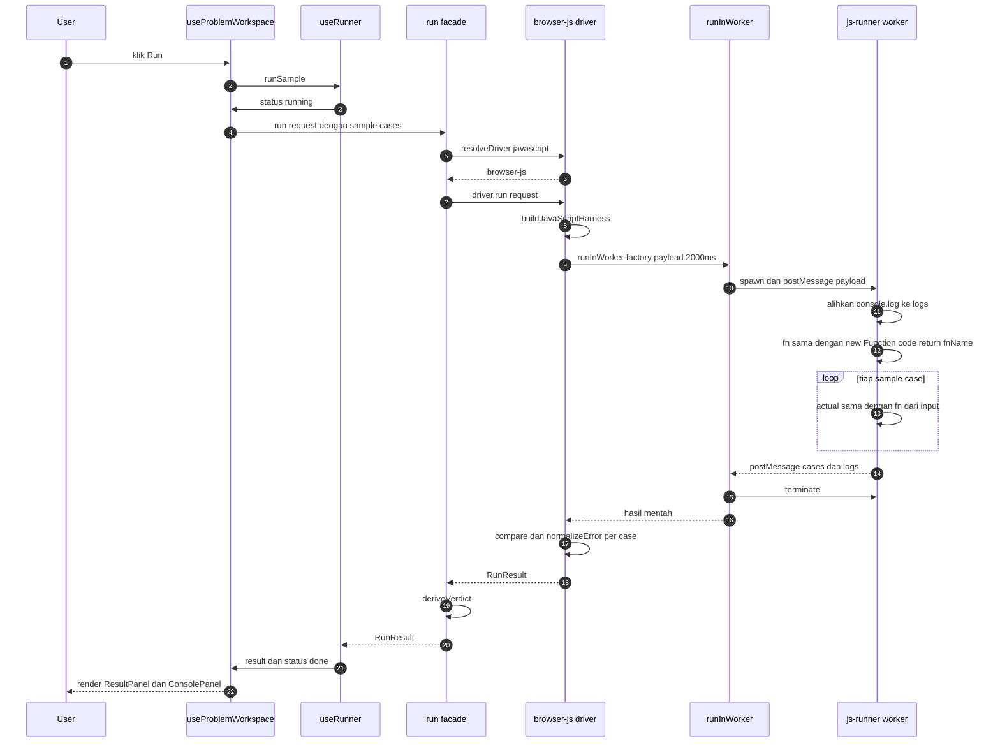
```mermaid
sequenceDiagram
  autonumber
  participant U as User
  participant W as useProblemWorkspace
  participant Rn as useRunner
  participant R as run facade
  participant D as browser-js driver
  participant WW as runInWorker
  participant JS as js-runner worker
  U->>W: klik Run
  W->>Rn: runSample
  Rn->>W: status running
  W->>R: run request dengan sample cases
  R->>D: resolveDriver javascript
  D-->>R: browser-js
  R->>D: driver.run request
  D->>D: buildJavaScriptHarness
  D->>WW: runInWorker factory payload 2000ms
  WW->>JS: spawn dan postMessage payload
  JS->>JS: alihkan console.log ke logs
  JS->>JS: fn sama dengan new Function code return fnName
  loop tiap sample case
    JS->>JS: actual sama dengan fn dari input
  end
  JS-->>WW: postMessage cases dan logs
  WW->>JS: terminate
  WW-->>D: hasil mentah
  D->>D: compare dan normalizeError per case
  D-->>R: RunResult
  R->>R: deriveVerdict
  R-->>Rn: RunResult
  Rn->>W: result dan status done
  W-->>U: render ResultPanel dan ConsolePanel
```

### S7. Run Sample — Python Pyodide
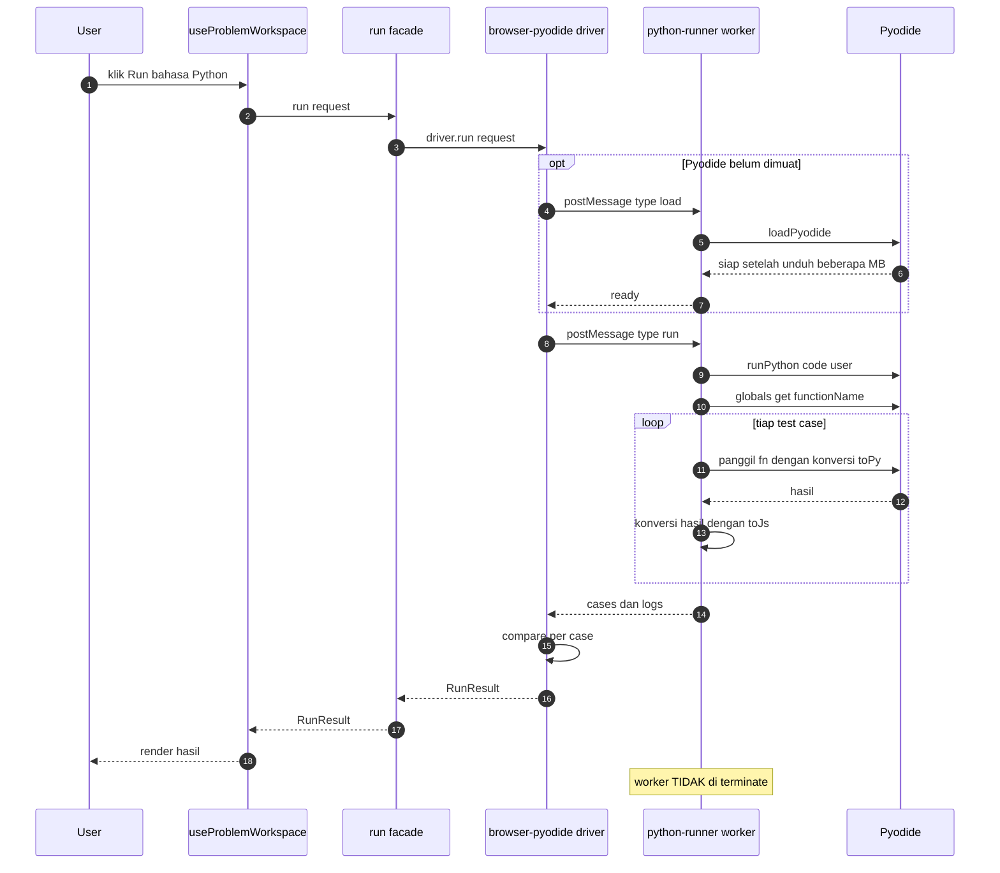
```mermaid
sequenceDiagram
  autonumber
  participant U as User
  participant W as useProblemWorkspace
  participant R as run facade
  participant D as browser-pyodide driver
  participant PW as python-runner worker
  participant PD as Pyodide
  U->>W: klik Run bahasa Python
  W->>R: run request
  R->>D: driver.run request
  opt Pyodide belum dimuat
    D->>PW: postMessage type load
    PW->>PD: loadPyodide
    PD-->>PW: siap setelah unduh beberapa MB
    PW-->>D: ready
  end
  D->>PW: postMessage type run
  PW->>PD: runPython code user
  PW->>PD: globals get functionName
  loop tiap test case
    PW->>PD: panggil fn dengan konversi toPy
    PD-->>PW: hasil
    PW->>PW: konversi hasil dengan toJs
  end
  PW-->>D: cases dan logs
  D->>D: compare per case
  D-->>R: RunResult
  R-->>W: RunResult
  W-->>U: render hasil
  Note over PW: worker TIDAK di terminate
```

### S8. Submit — Accepted dan Update Progress
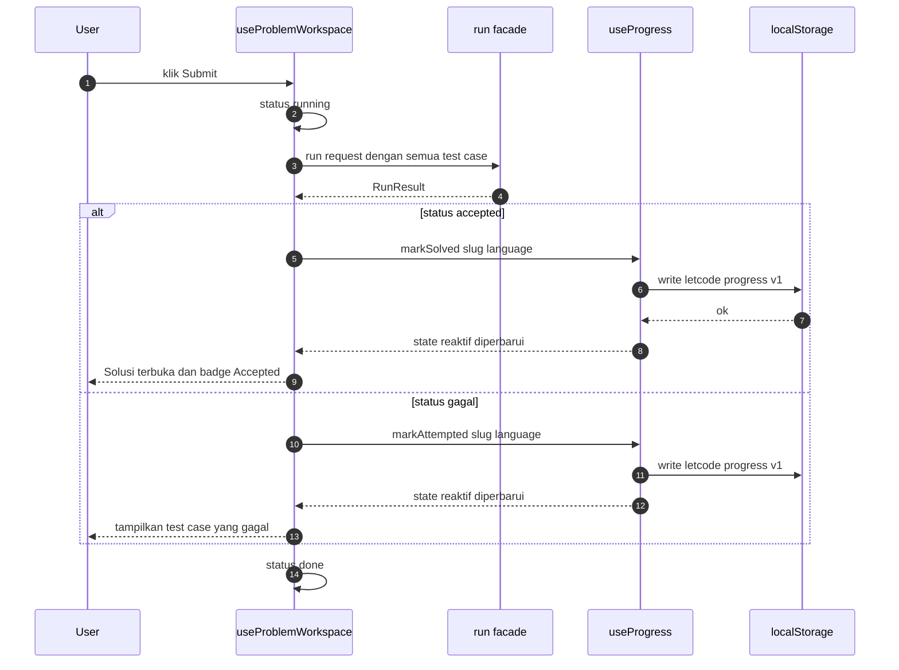
```mermaid
sequenceDiagram
  autonumber
  participant U as User
  participant W as useProblemWorkspace
  participant R as run facade
  participant P as useProgress
  participant LS as localStorage
  U->>W: klik Submit
  W->>W: status running
  W->>R: run request dengan semua test case
  R-->>W: RunResult
  alt status accepted
    W->>P: markSolved slug language
    P->>LS: write letcode progress v1
    LS-->>P: ok
    P-->>W: state reaktif diperbarui
    W-->>U: Solusi terbuka dan badge Accepted
  else status gagal
    W->>P: markAttempted slug language
    P->>LS: write letcode progress v1
    P-->>W: state reaktif diperbarui
    W-->>U: tampilkan test case yang gagal
  end
  W->>W: status done
```

### S9. Timeout dan Infinite Loop
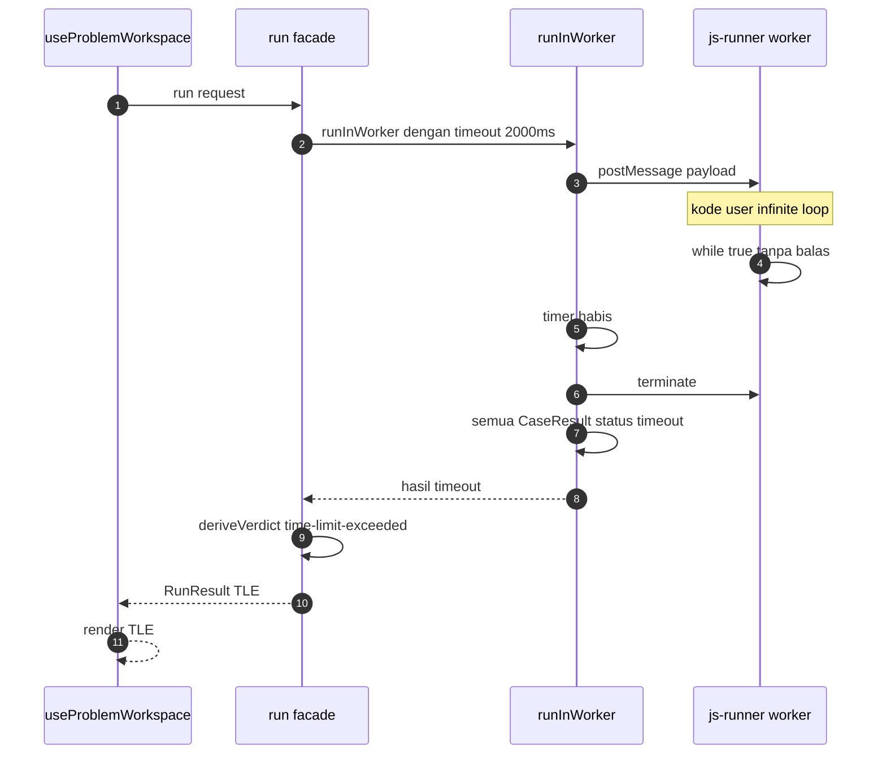
```mermaid
sequenceDiagram
  autonumber
  participant W as useProblemWorkspace
  participant R as run facade
  participant WW as runInWorker
  participant JS as js-runner worker
  W->>R: run request
  R->>WW: runInWorker dengan timeout 2000ms
  WW->>JS: postMessage payload
  Note over JS: kode user infinite loop
  JS->>JS: while true tanpa balas
  WW->>WW: timer habis
  WW->>JS: terminate
  WW->>WW: semua CaseResult status timeout
  WW-->>R: hasil timeout
  R->>R: deriveVerdict time-limit-exceeded
  R-->>W: RunResult TLE
  W-->>W: render TLE
```

### S10. Penanganan Error
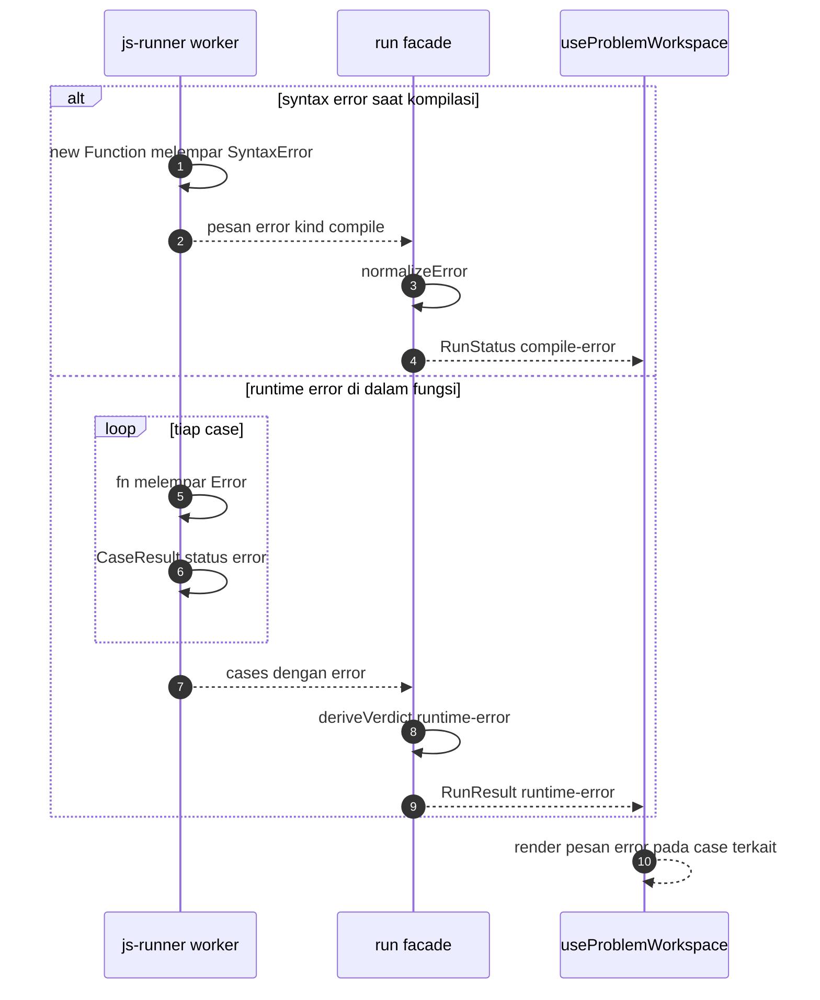
```mermaid
sequenceDiagram
  autonumber
  participant JS as js-runner worker
  participant R as run facade
  participant W as useProblemWorkspace
  alt syntax error saat kompilasi
    JS->>JS: new Function melempar SyntaxError
    JS-->>R: pesan error kind compile
    R->>R: normalizeError
    R-->>W: RunStatus compile-error
  else runtime error di dalam fungsi
    loop tiap case
      JS->>JS: fn melempar Error
      JS->>JS: CaseResult status error
    end
    JS-->>R: cases dengan error
    R->>R: deriveVerdict runtime-error
    R-->>W: RunResult runtime-error
  end
  W-->>W: render pesan error pada case terkait
```

### S11. Perhitungan Progress Track
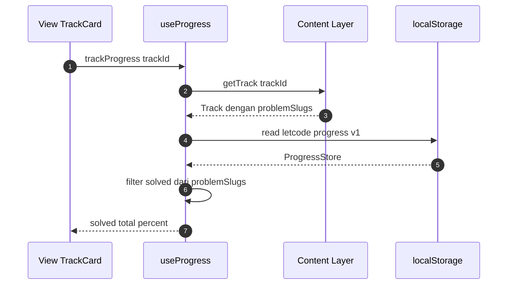
```mermaid
sequenceDiagram
  autonumber
  participant V as View TrackCard
  participant P as useProgress
  participant C as Content Layer
  participant LS as localStorage
  V->>P: trackProgress trackId
  P->>C: getTrack trackId
  C-->>P: Track dengan problemSlugs
  P->>LS: read letcode progress v1
  LS-->>P: ProgressStore
  P->>P: filter solved dari problemSlugs
  P-->>V: solved total percent
```

### S12. Validasi Konten Build-time
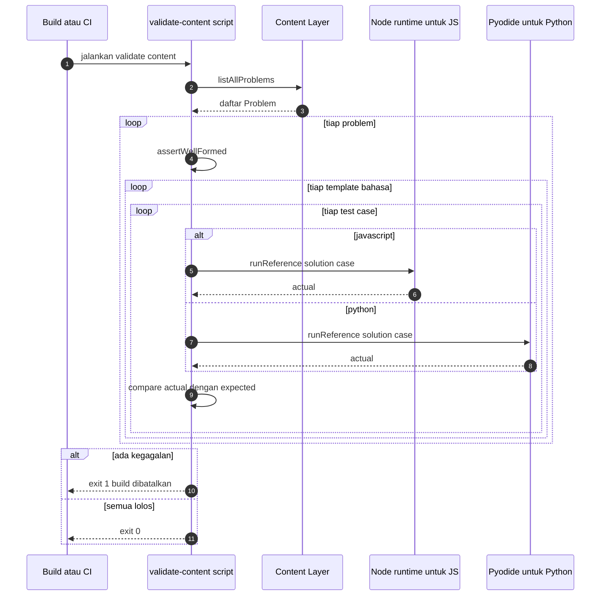
```mermaid
sequenceDiagram
  autonumber
  participant CI as Build atau CI
  participant S as validate-content script
  participant C as Content Layer
  participant NJ as Node runtime untuk JS
  participant PY as Pyodide untuk Python
  CI->>S: jalankan validate content
  S->>C: listAllProblems
  C-->>S: daftar Problem
  loop tiap problem
    S->>S: assertWellFormed
    loop tiap template bahasa
      loop tiap test case
        alt javascript
          S->>NJ: runReference solution case
          NJ-->>S: actual
        else python
          S->>PY: runReference solution case
          PY-->>S: actual
        end
        S->>S: compare actual dengan expected
      end
    end
  end
  alt ada kegagalan
    S-->>CI: exit 1 build dibatalkan
  else semua lolos
    S-->>CI: exit 0
  end
```

### S13. Build dan Deploy Statis
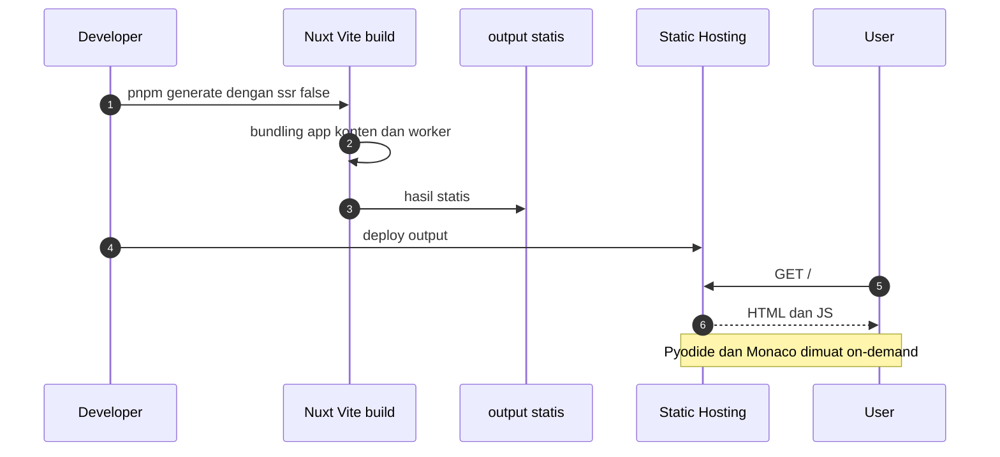
```mermaid
sequenceDiagram
  autonumber
  participant Dev as Developer
  participant NX as Nuxt Vite build
  participant OUT as output statis
  participant H as Static Hosting
  participant U as User
  Dev->>NX: pnpm generate dengan ssr false
  NX->>NX: bundling app konten dan worker
  NX->>OUT: hasil statis
  Dev->>H: deploy output
  U->>H: GET /
  H-->>U: HTML dan JS
  Note over U,H: Pyodide dan Monaco dimuat on-demand
```

### S14. Fase 3 — Remote Judge Tanpa Mengubah UI
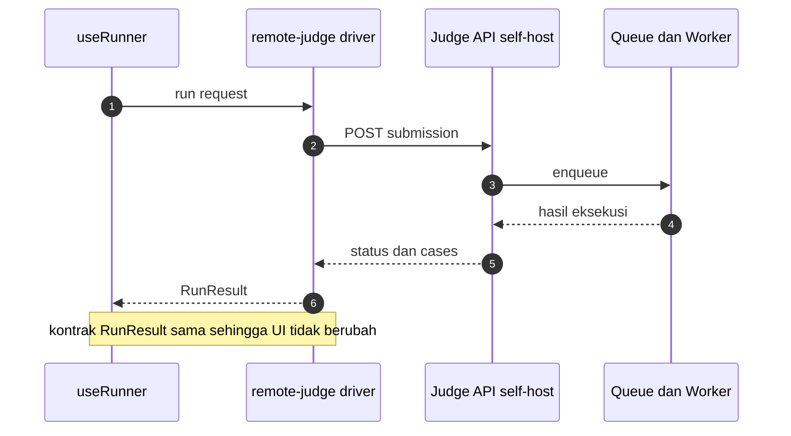
```mermaid
sequenceDiagram
  autonumber
  participant UI as useRunner
  participant RJ as remote-judge driver
  participant API as Judge API self-host
  participant Q as Queue dan Worker
  UI->>RJ: run request
  RJ->>API: POST submission
  API->>Q: enqueue
  Q-->>API: hasil eksekusi
  API-->>RJ: status dan cases
  RJ-->>UI: RunResult
  Note over UI,RJ: kontrak RunResult sama sehingga UI tidak berubah
```

### S15. Pergantian Tema
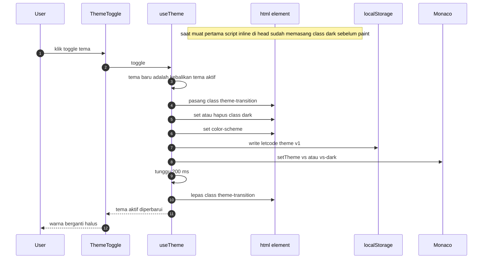
```mermaid
sequenceDiagram
  autonumber
  participant U as User
  participant T as ThemeToggle
  participant TH as useTheme
  participant DOM as html element
  participant LS as localStorage
  participant E as Monaco
  Note over DOM: saat muat pertama script inline di head sudah memasang class dark sebelum paint
  U->>T: klik toggle tema
  T->>TH: toggle
  TH->>TH: tema baru adalah kebalikan tema aktif
  TH->>DOM: pasang class theme-transition
  TH->>DOM: set atau hapus class dark
  TH->>DOM: set color-scheme
  TH->>LS: write letcode theme v1
  TH->>E: setTheme vs atau vs-dark
  TH->>TH: tunggu 200 ms
  TH->>DOM: lepas class theme-transition
  TH-->>T: tema aktif diperbarui
  T-->>U: warna berganti halus
```

---

## 18. Risiko & Mitigasi

| # | Risiko | Dampak | Mitigasi |
| --- | --- | --- | --- |
| R1 | ~~Biaya & keamanan sandbox~~ | — | Dimatikan oleh pilihan browser-first |
| R2 | Produksi konten berhenti di awal | Proyek mati | Batasi 1 track; pipeline validasi menjaga kualitas |
| R3 | Terlalu banyak bahasa/soal di awal | Tidak ada yang tamat | Fase 0 hanya JS, hanya 1 track |
| R4 | Monaco worker bundling rumit | Blokir Fase 0 | Kerjakan sebagai langkah tersendiri, bukan sambil jalan |
| R5 | Pyodide besar memperlambat UX | Pengguna menunggu | Lazy-load + `warmup()` saat bahasa dipilih |
| R6 | Soal cacat tayang | Kepercayaan rusak | Validasi build-time wajib |
| R7 | Kehilangan progress lokal | Frustrasi | Export/import JSON manual |

---

## 19. Roadmap Teknis

| Langkah | Hasil |
| --- | --- |
| 1 | Types + 1 track berisi 3–5 soal |
| 2 | Fungsi content + halaman `/tracks` (belum ada editor) |
| 3 | Worker JS + `runInWorker` dengan timeout/terminate |
| 4 | Harness + `compare` + `deriveVerdict` |
| 5 | Monaco + template + Reset |
| 6 | ResultPanel + ConsolePanel, `runSample()` end-to-end |
| 7 | `submit()` + `useProgress` + `useDraft` |
| 8 | Progres track di dashboard + `SolutionPanel` |
| 9 | Pyodide worker + `setLanguage` + prefetch |
| 10 | Script validasi konten, `ssr: false`, `nuxt generate`, deploy |

---

## 20. Pertanyaan Terbuka

1. **Render markdown** untuk `statement`/`material`/`explanation`:
   `markdown-it` (ringan, konten tetap di TS) atau `@nuxt/content`?
2. **Pinia atau composables murni?** Rekomendasi: composables dulu.
3. **Hidden test case**: terima sebagai batasan, atau pisahkan ke chunk terpisah?
4. **Nilai `timeLimitMs` default** dan apakah semua soal memakai nilai sama.
5. **Track pertama** yang dikerjakan (kandidat: Arrays & Hashing).
6. **Editor state**: simpan posisi kursor/scroll? (rendah prioritas)

---

## 21. Lampiran

### 21.1 Glossary
| Istilah | Arti |
| --- | --- |
| **Track** | Kumpulan soal yang terurut untuk satu topik |
| **Problem** | Satu soal dengan kontrak fungsi + test case |
| **Run** | Eksekusi terhadap test case sample |
| **Submit** | Eksekusi terhadap seluruh test case |
| **Verdict** | Hasil akhir: accepted / wrong-answer / TLE / runtime-error |
| **Judge** | Mesin yang mengeksekusi dan menilai kode |
| **Harness** | Pembungkus kode user agar fungsinya dapat dipanggil |
| **Pyodide** | Python yang dikompilasi ke WebAssembly |

### 21.2 Aturan Kontribusi Konten
1. Setiap soal wajib punya reference solution untuk semua bahasa.
2. Setiap soal wajib lolos `validate-content`.
3. Pernyataan soal ditulis sendiri; konsep boleh mengikuti roadmap umum.
4. Test case harus memuat minimal satu edge case.

### 21.3 Referensi
- `note.md` — catatan konsep hulu ke hilir.
- `blueprint.md` — rancangan logika (lapis, fungsi, alur).
- `https://vinicunca.dev/` — UnoCSS preset, ESLint config, perkakas.

---

## 22. Aturan Kerja & Protokol Eksekusi

Aturan ini mengikat setiap sesi kerja di proyek ini, termasuk sesi agen/AI.

### 22.1 Baca dulu sebelum mulai

Sebelum mengerjakan apa pun di proyek ini, **baca ketiga dokumen berikut lebih dulu**:

1. `note.md` — konsep hulu ke hilir dan keputusan yang sudah dikunci.
2. `blueprint.md` — rancangan logika: lapis, fungsi, alur.
3. `PRD.md` — dokumen ini.

Bila ada konflik antar dokumen, urutan prioritas: **PRD > blueprint > note**.

### 22.2 Tanya dulu kalau ambigu

Bila sebuah permintaan **ambigu, kurang lengkap, atau punya lebih dari satu tafsir yang
masuk akal**: **tanyakan lebih dahulu, jangan langsung eksekusi.**

Bentuk pertanyaannya:
- Sebutkan ambiguitasnya secara singkat.
- Berikan 2–4 opsi beserta konsekuensinya.
- Sertakan rekomendasi.

Contoh yang dianggap ambigu:
- Titik akhir pekerjaan tidak jelas (contoh: "perbaiki UI" — bagian mana, sejauh apa?).
- Ada dua pendekatan yang sama-sama wajar dengan biaya atau risiko yang berbeda jauh.
- Permintaan menyentuh keputusan yang sudah dikunci di bagian 2 tanpa menyebut perubahan itu.
- Cakupan melebar dari yang diminta (misalnya sekaligus me-refactor bagian lain).

Tidak perlu bertanya bila perintahnya sudah spesifik, atau sudah ada preseden jelas di
dokumen ini.

### 22.3 Jangan ubah keputusan yang sudah dikunci tanpa konfirmasi

Keputusan di bagian 2 hanya berubah bila diminta secara eksplisit.

### 22.4 Verifikasi sebelum menyatakan selesai

Setiap perubahan kode diakhiri dengan menjalankan pemeriksaan yang relevan: `pnpm lint`,
build/typecheck, dan test bila tersedia. Jangan meninggalkan kode yang rusak.

### 22.5 Perbarui dokumen

Bila ada keputusan baru di tengah jalan, catat ke `PRD.md` (dan `note.md` bila mengubah
konsep). Dokumen yang basi lebih berbahaya daripada tidak ada dokumen.

---

## 23. Struktur Folder

### 23.1 Pohon Direktori

```
letcode-app/
├── app/                            # srcDir Nuxt 4 — semua kode aplikasi
│   ├── app.vue                     # root component
│   ├── error.vue                   # halaman error / 404
│   ├── assets/
│   │   └── css/
│   │       └── main.css            # token & style global
│   ├── components/
│   │   ├── ui/                     # primitif, tanpa logika bisnis
│   │   ├── app/                    # kerangka aplikasi
│   │   ├── track/                  # track & daftar soal
│   │   ├── problem/                # isi soal
│   │   └── workspace/              # editor & panel hasil
│   ├── composables/                # lapis State (auto-import Nuxt)
│   ├── data/
│   │   ├── tracks/                 # definisi track
│   │   └── problems/               # definisi soal
│   ├── i18n/
│   │   └── messages.ts             # kamus pesan UI (id & en)
│   ├── lib/
│   │   └── runner/                 # lapis Runner (explicit import)
│   ├── pages/                      # route (file-based routing)
│   ├── types/                      # tipe bersama
│   ├── utils/                      # helper kecil (auto-import Nuxt)
│   └── workers/                    # Web Worker
├── public/                         # aset yang disajikan apa adanya
├── scripts/                        # tooling build-time
├── .vscode/settings.json           # auto-fix ESLint on save
├── eslint.config.mjs
├── nuxt.config.ts
├── uno.config.ts
├── tsconfig.json
├── package.json
├── note.md
├── blueprint.md
└── PRD.md
```

### 23.2 `app/pages/` — Routing

| File | Route | Isi |
| --- | --- | --- |
| `index.vue` | `/` | Dashboard: progres keseluruhan + kartu track |
| `tracks/index.vue` | `/tracks` | Semua track sebagai roadmap berurutan |
| `tracks/[trackId].vue` | `/tracks/:id` | Materi singkat + daftar soal + progres track |
| `problems/index.vue` | `/problems` | Semua soal + filter difficulty/status (Fase 2) |
| `problems/[slug].vue` | `/problems/:slug` | **Workspace** — deskripsi + editor + panel hasil |
| `about.vue` | `/about` | Opsional |

### 23.3 `app/components/` — Komponen

**`ui/` — primitif, tanpa logika bisnis**

| Komponen | Tanggung jawab |
| --- | --- |
| `BaseButton.vue` | Tombol dengan varian primary/ghost/danger lewat `uv()` |
| `BaseCard.vue` | Wadah konten dengan radius & padding konsisten |
| `BaseBadge.vue` | Label kecil (difficulty, status) |
| `BaseProgressBar.vue` | Indikator progres track |
| `BaseSpinner.vue` | Indikator memuat |
| `BaseEmptyState.vue` | Keadaan kosong yang informatif |

**`app/` — kerangka aplikasi**

| Komponen | Tanggung jawab |
| --- | --- |
| `AppHeader.vue` | Judul, navigasi utama, tautan kembali |
| `AppFooter.vue` | Opsional |
| `ThemeToggle.vue` | Tombol ganti tema light/dark |

**`track/` — track & daftar soal**

| Komponen | Tanggung jawab |
| --- | --- |
| `TrackCard.vue` | Ringkasan satu track + progres |
| `TrackProgressBar.vue` | Progres track memakai `useProgress` |
| `ProblemListItem.vue` | Baris soal: judul, difficulty, status selesai |

**`problem/` — isi soal**

| Komponen | Tanggung jawab |
| --- | --- |
| `ProblemStatement.vue` | Render markdown pernyataan soal |
| `ProblemExample.vue` | Menampilkan satu contoh input/output |
| `DifficultyBadge.vue` | Label easy/medium/hard/expert |
| `HintAccordion.vue` | Hint bertingkat, dibuka bertahap |
| `SolutionPanel.vue` | Pembahasan, hanya tampil setelah soal solved |

**`workspace/` — editor & hasil**

| Komponen | Tanggung jawab |
| --- | --- |
| `CodeEditor.vue` | Pembungkus Monaco, client-only |
| `LanguageSelect.vue` | Pemilih bahasa (JS/Python) |
| `WorkspaceToolbar.vue` | Tombol Reset, Run, Submit |
| `ResultPanel.vue` | Daftar hasil per test case |
| `TestCaseRow.vue` | Satu baris hasil: input, expected, actual, status |
| `VerdictBadge.vue` | Verdict akhir: Accepted / Wrong Answer / TLE / Error |
| `ConsolePanel.vue` | Log `console.log` / `print` milik user |

### 23.4 `app/composables/` — Lapis State

| File | Tanggung jawab |
| --- | --- |
| `useProblemWorkspace.ts` | Orkestrasi halaman soal: kode, bahasa, run, submit |
| `useRunner.ts` | Status eksekusi, hasil, `run()`, `cancel()` |
| `useProgress.ts` | Status soal & progres track di `localStorage` |
| `useDraft.ts` | Draft kode per soal per bahasa (debounce 500 ms) |
| `useCodeEditor.ts` | Mount/dispose Monaco, set bahasa, ambil nilai |
| `useSettings.ts` | Preferensi ringan (bahasa terakhir dipakai) |
| `useTheme.ts` | Tema aktif, toggle, persistensi, transisi, ikut setelan sistem |

### 23.5 `app/lib/runner/` — Lapis Runner

Sengaja **di luar** `utils/` supaya tidak ikut auto-import Nuxt. Semua pemanggilan harus
eksplisit, sesuai aturan arsitektur bahwa UI tidak pernah menyentuh Worker langsung.

| File | Tanggung jawab |
| --- | --- |
| `index.ts` | Facade `run(request)` + `resolveDriver(language)` |
| `js-driver.ts` | Driver JavaScript (browser-js) |
| `pyodide-driver.ts` | Driver Python (browser-pyodide) + `warmup()` |
| `harness.ts` | `buildJavaScriptHarness` — menyusun ulang kode peserta agar mengembalikan fungsi target |
| `compare.ts` | Komparator `deepEqual`, `unorderedDeepEqual`, `unorderedAllLevels`, `floatApprox` |
| `verdict.ts` | `deriveVerdict(cases)` |
| `errors.ts` | `normalizeError` — bedakan compile / runtime / timeout |
| `protocol.ts` | Tipe pesan UI ↔ Worker |

### 23.6 `app/workers/` — Web Worker

| File | Tanggung jawab |
| --- | --- |
| `js-runner.ts` | Eksekusi JS; satu worker per run, lalu di-terminate |
| `python-runner.ts` | Pyodide; worker persisten, tidak di-terminate |

### 23.7 `app/data/` — Konten

Soal dikelompokkan **per track**, satu folder per track:

| Path | Isi |
| --- | --- |
| `data/tracks/<track-id>.ts` | Definisi satu track: judul, ringkasan, `sections` materi, urutan soal |
| `data/tracks/index.ts` | Agregasi semua track |
| `data/problems/index.ts` | Agregasi soal dari seluruh folder track |
| `data/problems/<track-id>/index.ts` | Agregasi soal satu track |
| `data/problems/<track-id>/<slug>.ts` | Definisi satu soal: kontrak, test case, template, reference solution |

Aturan:

1. Satu file = satu track atau satu soal.
2. `problem.trackId` **wajib** sama dengan nama folder tempat file itu berada —
   diperiksa otomatis oleh validator.
3. Semua data **wajib** lolos `scripts/validate-content.ts` sebelum ikut build.

### 23.8 `app/utils/` & `app/types/`

**`utils/`** — helper kecil, ikut auto-import Nuxt.

| File | Tanggung jawab |
| --- | --- |
| `content.ts` | Loader: `listTracks`, `getTrack`, `getProblem`, `listProblemsByTrack`, `getAdjacentProblems`, `getSampleCases`, `getHiddenCases` |
| `markdown.ts` | `renderMarkdown` — markdown-it dengan `html: false` |
| `storage.ts` | Adapter `localStorage`: baca/tulis JSON dengan `version` |

**`types/`** — tipe bersama, diimpor eksplisit.

| File | Isi |
| --- | --- |
| `content.ts` | `Track`, `MaterialSection`, `Problem`, `TestCase`, `Example`, `CodeTemplate`, `Difficulty`, `LanguageId`, `ComparatorId` |
| `i18n.ts` | `Locale`, `Localized<T>`, `LOCALES`, `LOCALE_LABELS`, `DEFAULT_LOCALE` |
| `runner.ts` | `RunRequest`, `RunResult`, `CaseResult`, `RunStatus`, `CaseStatus`, `JudgeDriver` |
| `state.ts` | `ProgressStore`, `ProblemRecord`, `ProblemStatus`, `SettingsStore` |

### 23.9 `app/assets/` & `public/` — Aset

| Aset | Lokasi | Status |
| --- | --- | --- |
| `favicon.ico` | `public/` | sudah ada dari template |
| `favicon.svg` | `public/` | belum |
| `robots.txt` | `public/` | sudah ada dari template |
| `og-image.png` | `public/` | Fase 2, untuk pratinjau tautan |
| `main.css` | `app/assets/css/` | belum — token warna, spasi, tipografi |
| Font | — | **tidak ada** — memakai system font stack |
| File ikon (SVG) | — | **tidak ada** — ikon dari class UnoCSS |
| Ilustrasi / gambar | — | **tidak ada** — sesuai prinsip minimalis |

Prinsip: `app/assets/` untuk aset yang diproses build (CSS, gambar yang diimpor kode);
`public/` untuk yang disajikan apa adanya dengan nama tetap.

### 23.10 Ikon

Ikon dipakai sebagai **class UnoCSS**, bukan file. Sumber: `@iconify-json/lucide`
(belum dipasang — `pnpm add -D @iconify-json/lucide`).

| Ikon | Dipakai di |
| --- | --- |
| `i-lucide-play` | Tombol Run |
| `i-lucide-send` | Tombol Submit |
| `i-lucide-rotate-ccw` | Tombol Reset |
| `i-lucide-check` | Status test case passed |
| `i-lucide-x` | Status test case failed |
| `i-lucide-clock` | Status timeout |
| `i-lucide-triangle-alert` | Status error |
| `i-lucide-circle-check-big` | Verdict Accepted |
| `i-lucide-lightbulb` | Hint |
| `i-lucide-terminal` | Panel konsol |
| `i-lucide-lock` / `i-lucide-lock-open` | Pembahasan terkunci / terbuka |
| `i-lucide-chevron-left` / `i-lucide-chevron-right` | Navigasi soal sebelumnya/berikutnya |
| `i-lucide-loader-circle` | Indikator memuat |
| `i-lucide-search` | Pencarian soal (Fase 2) |
| `i-lucide-filter` | Filter soal (Fase 2) |
| `i-lucide-menu` | Navigasi mobile |
| `i-lucide-sun` / `i-lucide-moon` | Tombol toggle tema |

Catatan: nama ikon mengikuti penamaan Lucide versi terkini dan **wajib diverifikasi**
setelah koleksi dipasang, karena beberapa ikon pernah berganti nama.

### 23.11 `scripts/` & File Root

| File | Tanggung jawab |
| --- | --- |
| `scripts/validate-content.ts` | Validasi seluruh soal terhadap reference solution; exit 1 bila ada yang gagal |
| `nuxt.config.ts` | Konfigurasi Nuxt, modul `@unocss/nuxt`, `ssr: false` |
| `uno.config.ts` | `presetVinicunca()` |
| `eslint.config.mjs` | `vinicuncaESLint()` dengan `vue`, `typescript`, `unocss` |
| `tsconfig.json` | Project references Nuxt |
| `note.md`, `blueprint.md`, `PRD.md` | Dokumen proyek (wajib dibaca sebelum mulai kerja) |

### 23.12 Aturan Penamaan & Penempatan

1. **Komponen**: PascalCase, nama file = nama komponen (`ProblemListItem.vue`).
2. **Composable**: `useXxx.ts`, satu composable utama per file.
3. **File tipe**: huruf kecil (`content.ts`, `runner.ts`).
4. **Worker**: `<bahasa>-runner.ts`.
5. **Data**: satu file per entitas, nama file = `slug` soal.
6. **Komponen di `ui/` tidak boleh** memanggil `useProgress`, `useRunner`, atau content —
   hanya menerima props dan memancarkan event.
7. **Lapisan Runner tidak boleh** mengimpor apa pun dari `composables/`, `components/`,
   atau `pages/`.
8. **Lapisan Content tidak boleh** mengimpor dari Runner.
9. Yang dipakai di lebih dari satu lapis masuk ke `types/`, bukan didefinisikan ulang.

---

## 24. Internasionalisasi (i18n)

### 24.1 Ruang Lingkup
Dua bahasa: **Indonesia (`id`)** dan **Inggris (`en`)**. Yang diterjemahkan mencakup
seluruh teks yang dilihat pengguna:

| Bagian | Diterjemahkan | Catatan |
| --- | --- | --- |
| Navigasi, tombol, label, pesan status | Ya | kamus `app/i18n/messages.ts` |
| Judul & ringkasan track | Ya | `Track.title`, `Track.summary` |
| Materi track | Ya | `Track.material` |
| Judul, pernyataan, hint, pembahasan soal | Ya | `Problem.title`, `statement`, `hints`, `explanation` |
| Penjelasan contoh | Ya | `Example.explanation` |
| `Example.input` / `Example.output` | Tidak | sudah universal (notasi teknis) |
| Kode template & reference solution | Tidak | komentar memakai bahasa Inggris agar netral |
| Nama kesulitan (Easy/Medium/Hard/Expert) | Tidak | istilah teknis yang lazim dipakai apa adanya |

### 24.2 Pendekatan
Memakai composable sendiri, **bukan** `@nuxtjs/i18n`. Alasan:

1. Kebutuhan hanya dua bahasa dan teks statis.
2. `@nuxtjs/i18n` mengubah URL menjadi berprefiks (`/en/...`) — tidak diperlukan di sini,
   dan berisiko terhadap kunci `localStorage` yang berbasis `slug`.
3. Tidak menambah dependency baru.

**Berkas terkait:**

| Berkas | Peran |
| --- | --- |
| `app/types/i18n.ts` | `Locale`, `Localized<T>`, `LOCALES`, `LOCALE_LABELS`, `DEFAULT_LOCALE` |
| `app/i18n/messages.ts` | Kamus pesan UI; `MessageKey` diturunkan dari kamus `id`, dan kamus `en` wajib lengkap |
| `app/composables/useI18n.ts` | `locale`, `setLocale`, `t(key, params)`, `localized(value)` |

Kamus `en` dideklarasikan sebagai `Record<MessageKey, string>` sehingga kunci yang hilang
gagal saat kompilasi, bukan saat runtime.

### 24.3 Perilaku
- Saat pertama kali dibuka dan belum ada pilihan tersimpan: **ikut bahasa browser**
  (`navigator.languages`), dengan fallback `id`.
- Setelah pengguna menekan tombol switch: pilihannya disimpan di `letcode:locale:v1` dan
  menimpa deteksi otomatis.
- Atribut `<html lang>` selalu disinkronkan dengan bahasa aktif.
- Pergantian bahasa bersifat reaktif: seluruh teks dan konten berganti tanpa reload.

### 24.4 Kunci `localStorage`
| Kunci | Isi | Format |
| --- | --- | --- |
| `letcode:locale:v1` | `'id'` atau `'en'`; tidak ada berarti ikut browser | string |

### 24.5 Tombol Switch
Berupa segmented control kecil `ID | EN` di `AppHeader`, bersebelahan dengan `ThemeToggle`.
Menampilkan kedua opsi sekaligus (bukan tombol toggle tunggal) supaya bahasa aktif langsung
terlihat, dan konsisten dengan pola `LanguageSelect` di workspace.

### 24.6 Mencegah Ketidaksesuaian Saat Muat
Script boot inline di `<head>` (bersama script tema) menetapkan `document.documentElement.lang`
sebelum aplikasi hidrasi, memakai urutan yang sama: pilihan tersimpan → bahasa browser → `id`.

### 24.7 Menambah Bahasa Baru
1. Tambahkan kode bahasa ke `Locale` dan `LOCALES` di `app/types/i18n.ts`.
2. Tambahkan kamus baru di `app/i18n/messages.ts` (kompilasi akan menuntut kelengkapannya).
3. Tambahkan versi bahasa pada setiap field `Localized<T>` di `app/data/`.

---

## 25. Kurikulum & Konversi Data

### 25.1 Daftar Track
11 track, diurutkan dari fondasi ke lanjutan. Setiap track berisi 5 soal.

| # | id | Topik |
| --- | --- | --- |
| 1 | `arrays-hashing` | Arrays & Hashing |
| 2 | `two-pointers` | Two Pointers |
| 3 | `sliding-window` | Sliding Window |
| 4 | `stack` | Stack |
| 5 | `binary-search` | Binary Search |
| 6 | `linked-list` | Linked List |
| 7 | `trees` | Trees |
| 8 | `heap` | Heap / Priority Queue |
| 9 | `graphs` | Graphs |
| 10 | `dynamic-programming` | Dynamic Programming |
| 11 | `backtracking` | Backtracking |

Urutan ini mengikuti kurikulum di `note.md` bagian 7, dengan Backtracking sebagai topik
pelengkap karena polanya wajib dikuasai untuk interview.

### 25.2 Materi Berbentuk Section
Materi track **tidak** berupa satu blok markdown, melainkan array `sections`. Setiap
section punya `id` (anchor), `title`, dan `body` (markdown). Halaman track merender daftar
isi yang bisa diklik di atas, lalu setiap section sebagai sub-bab tersendiri.

Struktur section yang dipakai konsisten di semua track:

| id | Isi |
| --- | --- |
| `kenapa` | Kenapa topik ini penting untuk interview |
| `konsep` | Konsep inti, dijelaskan dari nol |
| `pola` | Pola-pola utama dan kapan dipakai |
| `jebakan` | Kesalahan yang sering terjadi |
| `ingat` | Ringkasan + saran urutan latihan |

### 25.3 Konversi Data untuk Python (penting)
Argumen dan nilai kembalian antara JS dan Python **tidak** memakai `toPy`/`toJs`, melainkan
melewati JSON:

```
JS:  JSON.stringify(args)  →  Python: json.loads(...)
Python: json.dumps(result, default=str)  →  JS: JSON.parse(...)
```

Alasannya, konversi bawaan Pyodide tidak simetris untuk nilai kosong:

| Arah | Bawaan Pyodide | Lewat JSON |
| --- | --- | --- |
| JS `null` → Python | sentinel `JsNull` (bukan `None`) | `None` |
| Python `None` → JS | `undefined` (bukan `null`) | `null` |

Tanpa jembatan ini, soal pohon biner dan linked list tidak bisa dinilai dengan benar di
Python, karena `null` adalah bagian sah dari representasi level-order.

**Konsekuensi untuk penulis konten:** `null` aman dipakai di `expected`, dan solusi Python
boleh mengembalikan `None` di dalam list. Tipe yang tidak dikenal `json.dumps` dikonversi
lewat `default=str`, sehingga tetap tidak membuat eksekusi gagal — hanya hasilnya tidak
akan cocok dengan `expected`.

### 25.4 Batasan Representasi Data
Semua input dan output harus JSON-serializable, karena melewati batas worker. Karena itu:

| Struktur | Representasi |
| --- | --- |
| Linked list | Array; contoh `[1,2,3]` berarti `1 → 2 → 3` |
| Binary tree | Array level-order dengan `null` untuk anak kosong |
| Graph | Matriks adjacency atau daftar sisi (`number[][]`) |

Peserta membangun struktur datanya sendiri di dalam kode (misalnya kelas `ListNode` atau
`TreeNode` yang didefinisikan di template), memproses, lalu mengembalikan hasil sebagai
nilai JSON. Ini justru melatih keterampilan membangun dan menelusuri struktur tersebut.
